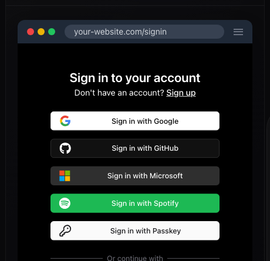
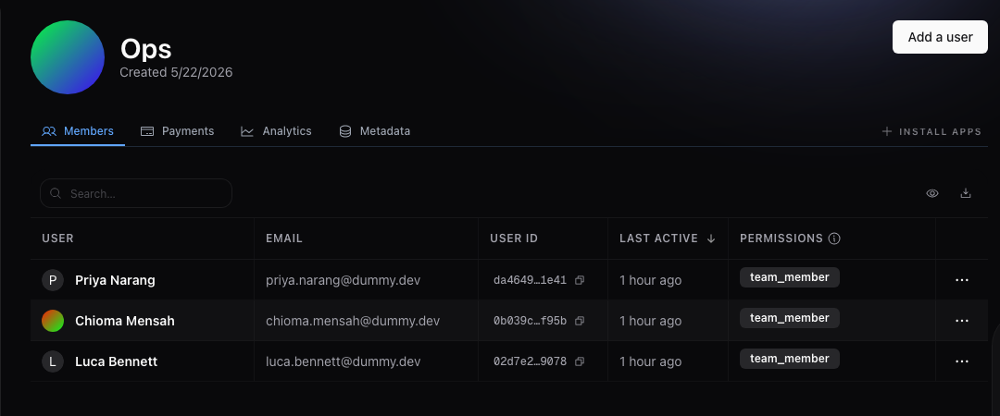

<div align="center">


<br/>

**The user infrastructure platform.**

Hexclave handles everything around your users: authentication, teams,
payments, emails, analytics, and much more. Start in minutes on the hosted
cloud. Your data is always yours to export and self-host.

[Website](https://hexclave.com) · [Docs](https://docs.hexclave.com) · [Dashboard](https://app.hexclave.com) · [Discord](https://discord.hexclave.com)


</div>

---

## Get started

Setting up Hexclave is one prompt. Paste this into your coding agent of choice:

```
Read try.hexclave.com and help me setup hexclave in this project
```

## What's included

Hexclave ships as a catalog of apps you switch on as your product needs them.
Each one is built on the same user model, and new apps land regularly.

<table><tr>
<td width="50%" valign="middle">

###  &nbsp; Authentication

Authentication that just works with passkeys, OAuth, and CLI auth. Drop in one component and ship the whole flow; auth methods toggle from the dashboard with no code changes needed.

</td>
<td width="50%" valign="middle" align="center">

</td>
</tr></table>

<table><tr>
<td width="50%" valign="middle">

###  &nbsp; Teams

Build for teams, not just users, with workspaces, email invites, and roles that actually gate the work. The workspace switcher remembers selection, invites auto sign up new users, and permissions hold up under audit.

</td>
<td width="50%" valign="middle" align="center">

</td>
</tr></table>

## Contributing

Hexclave is open source, and contributions are welcome. Read
[`CONTRIBUTING.md`](./CONTRIBUTING.md) to get started, and say hello in
[Discord](https://discord.hexclave.com) before picking up anything large.
Found a security issue? Email security@hexclave.com.
