<!-- START doctoc generated TOC please keep comment here to allow auto update -->
<!-- DON'T EDIT THIS SECTION, INSTEAD RE-RUN doctoc TO UPDATE -->

- [Hexclave](#hexclave)
  - [Get started](#get-started)
  - [What's included](#whats-included)
  - [SDKs](#sdks)
  - [Contributing](#contributing)

<!-- END doctoc generated TOC please keep comment here to allow auto update -->

<div align="center">


**The user infrastructure platform.**

Hexclave handles everything around your users: authentication, teams,
payments, emails, analytics, and many more features, so you don't have to
build it yourself. Start in minutes on the hosted cloud. Your data is always
yours to export and self-host.

[Website](https://hexclave.com) · [Docs](https://docs.hexclave.com) · [Dashboard](https://app.hexclave.com) · [Discord](https://discord.hexclave.com)


</div>

---

## Get started

Setting up Hexclave is one prompt. Paste this into your coding agent of choice:

```
Read try.hexclave.com and help me setup hexclave in this project
```

## What's included

Hexclave ships as a catalog of apps you switch on as your product needs them.
Each one is built on the same user model, and new apps land regularly.

### 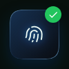 &nbsp; Authentication

Passwords, OAuth, magic links, and passkeys, with pre-built UI and sign-up fraud protection.

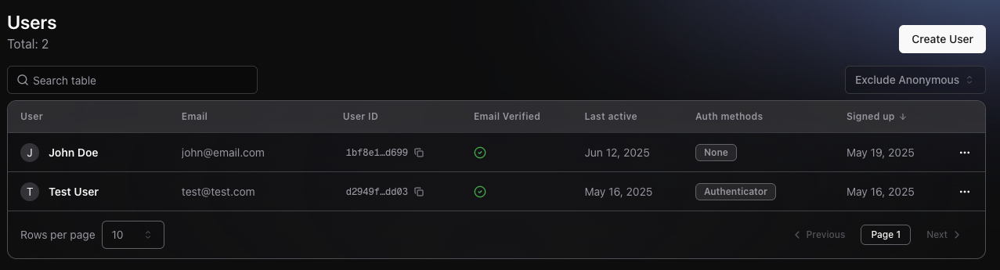

---

###  &nbsp; Teams

Multi-tenant organizations, members, and invitations.

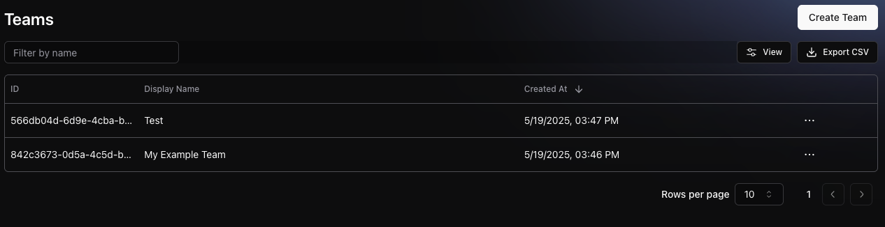

---

###  &nbsp; RBAC

Role-based access control with project and team permissions.

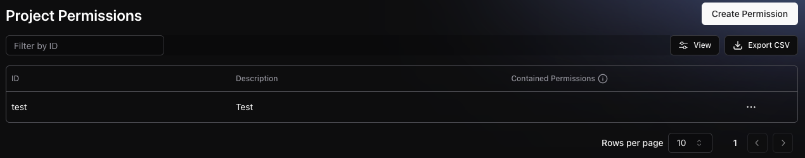

---

###  &nbsp; API Keys

Issue and manage publishable and secret API keys.

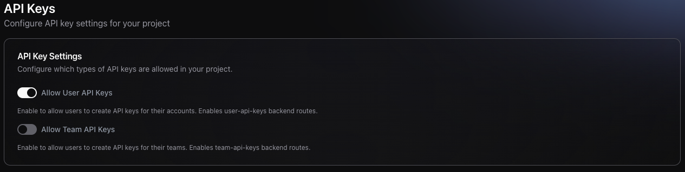

---

###  &nbsp; Payments

Product lines, checkout, subscriptions, and payouts.

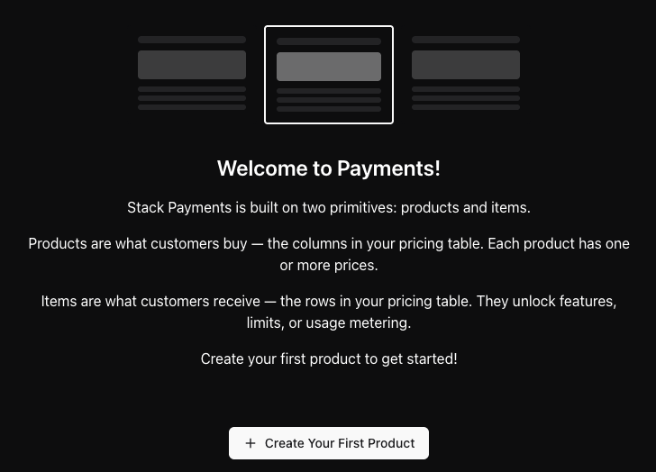

---

###  &nbsp; Emails

Transactional email with templates, themes, and delivery logs.

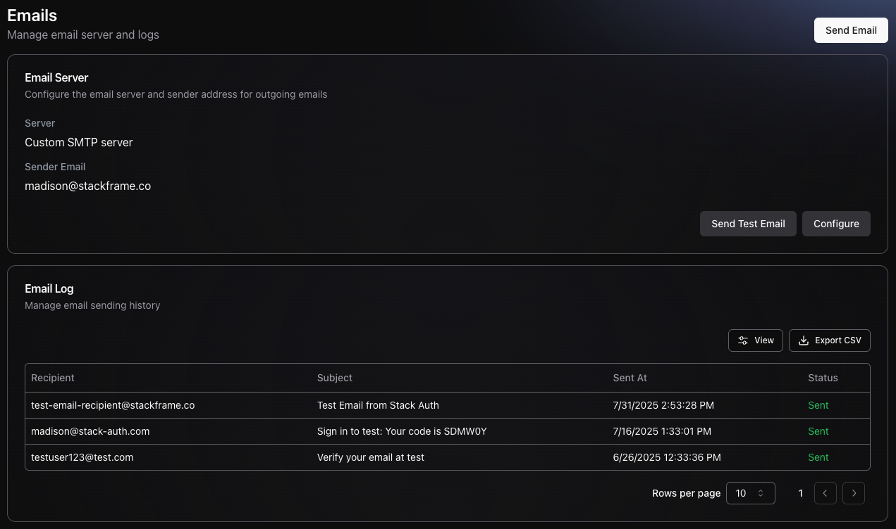

---

### 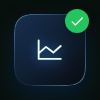 &nbsp; Analytics

Explore your product's events, usage data, and session replays.

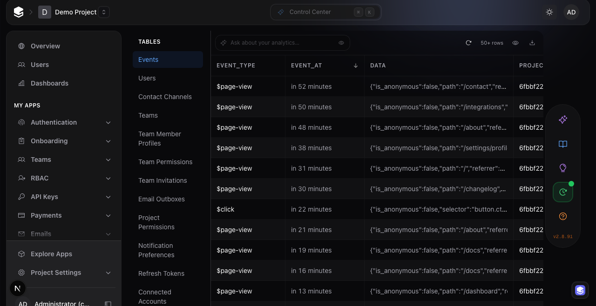

---

###  &nbsp; Webhooks

Real-time event notifications for your own services.

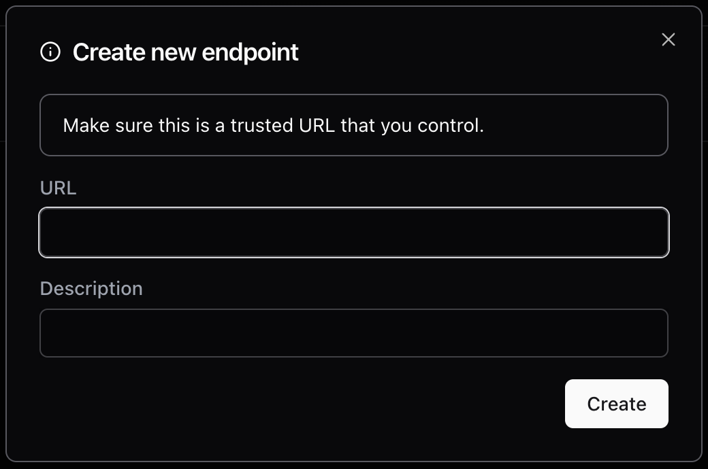

---

###  &nbsp; Data Vault

Encrypted storage for your users' sensitive data.

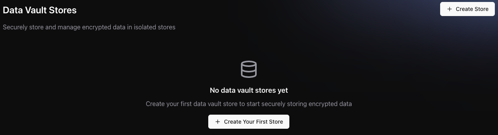

---

### 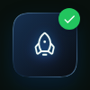 &nbsp; Launch Checklist

Pre-launch verification and readiness checks.

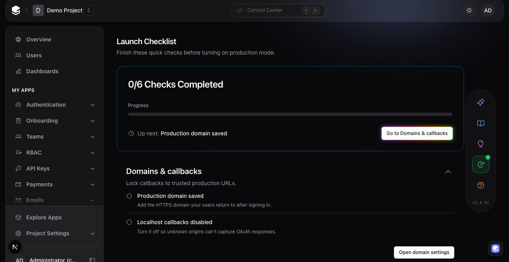

## Contributing

Hexclave is open source, and contributions are welcome. Read
[`CONTRIBUTING.md`](./CONTRIBUTING.md) to get started, and say hello in
[Discord](https://discord.hexclave.com) before picking up anything large.
Found a security issue? Email security@hexclave.com.
